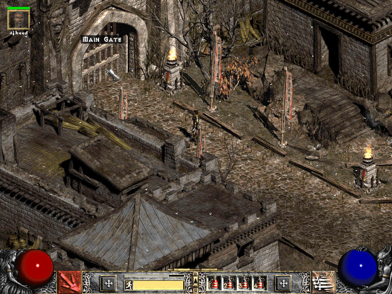
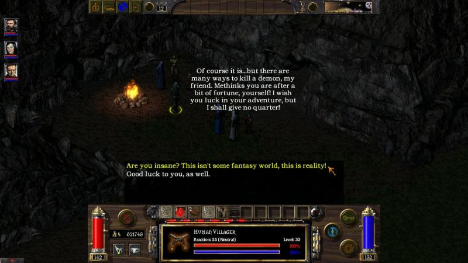
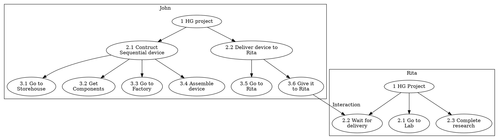
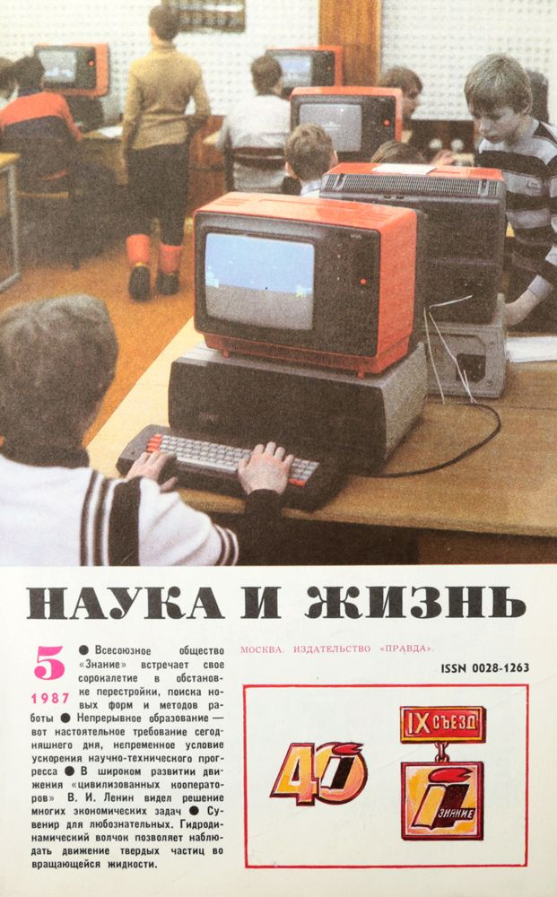
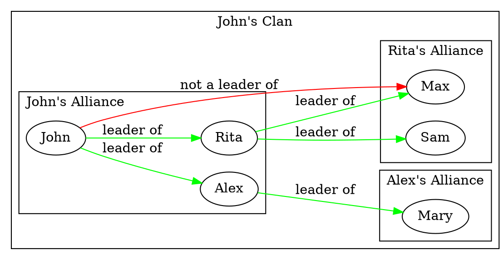

# Gameplay

The gameplay takes place on isometric view tile map set, when the player controls his avatar-character through the point-and-click mechanics to explore big open world.

The map consists of a number of objects including elements of terrain landscape, plants, cliffs, rivers, etc, and the elements of the build facilities such as buildings, various engineering constructions, bridges, tunnels, roads, habitation domes, transportation vehicles including trains and many other.

All elements of the map procedurally generated based on a number of a smaller predefined components such as walls, rooves, interrior objects etc.

The player is able to step into the buildings and its' rooms, interact with objects inside the buildings including electronic devices, computers, control panels, buttons, leverages, mechanisms, elevators, books, and some other small objects. He can read texts and messages found in books and devices, and keep them as notes in the UI.

There is one primary map in the game where the main action taking place and available for exploring by the player's controller character, and several independent small maps for side quests. The player is able to use vehicals to move between maps, and also to travel inside a single map faster. An example of such transportations could be, for example, ships to travel by water from the Island to the mainland, a Spacecraft to travel to the moon and back, and the monorail train to travel on the Island's map.

The primary game map is a tropical Island. In the beginnig of the game the Island map is already developed. The player and the commmunity of characters are keep developing and evolving it until another point of time from which they will relocate to the map of the Moon site with the different set of content, to establish moon base from scratch. For details see [Plot and Setting](#plot-and-setting) section.

All permanent non-playable characters in the game are completely independent and procedurally generated units that have the same capabilities as the playable character does. They live their own life in the game world, and interacting to each other as well as to the playable character, and the same way the playable character does. Both playable and non-playable characters can initiate dialogues to each other, take part in quests, building up social relationships, assembling new buildings, facilities and goods, advancing researches and economics of the game. The non-playable characters are driven by the game AI simulation models.

The overlall number of the non-playable characters actively simualted by the primary game AI is around a hundred of units. But the game engine also simulates more units that reveals on the map temporary from time to time, and not available for interaction. They perform direct predefined scenario driven actions only or is a part of the environment. Example of such units are robots, animals, the temporary visitors of the Island and the storytelling characters.

The list of base actions that simulated NPCs can do are:
 - Walking to specific place on map by foot, using vehicals or any other transportations.
 - Getting an object to be delivered to another place.
 - Applying the object to the target place, facility or giving it to another agent.
 - Getting a construction device.
 - Working with specific facility. This includes assembling devices, vehicals, mechanisms. Also taking part in construction of the building, working on researches in labs etc.
 - Initiating conversation session with another agent to set or recieve directs, and to gether or to provide information.
 - Performing an everyday and regular objectives such as sleep, rest, recreation, medical examinations, etc.

The dialog options and the quests are not predefined(except a few storytelling events), and completely based on the current gameplay situation that dynamically changing.

The primary ways of walking thought the game are:
 - By interacting with other NPCs, understanding connections between them based on gathered data and influencing characters through dialogs and quest completion to achieve desirable goals.
 - Leveling up personal skills, but also helping other characters to level up their skills to.
 - Taking part in research and engineering projects and/or organizing own projects.
 - Taking part in existing "tribes" and/or organizing a new one.
 - Building up personal political influence, and changing the overall characters community policy in various ways.
 - Technological progression of the overal community.

Any forms of fight interactions or violance mechanics are missing in the game. The game is primary focuses on social interactions and development of the game world in a purely peaceful way.

## Game AI Model

As was mentioned [ealier](#solution) non-playable characters should be able to interact to each other autonomously from the player, unite into groups to organize common tasks and to evolve the game world in general. All NPCs can make decisions based only on their personal traits and the information they can gether from the game world during their life experience in the game. So the NPC is, broadly speaking, in the same boat as the playable character.

All non-playable characters represent a set of *game agents*.  For the sake of simplicity we will call both playable and non-playable characters as *agents*. Both have the same set of base characteristics and interaction options and are equal from the game mechnics point of view. In general, NPCs don't distinct between the player's controlled character and other NPCs when they interact to each other. The differences are only in the way of control: the playable character actions are driven by a player, and NPCs are driven by the game AI.

Agent's actual actions are driven by the Task Tree Framework.

### Task Tree Framework

Each AI controlled agent has a set of tasks that it wants to perform. The set of tasks shaping a tree of tasks when each subnode represents a subtask required to be performed to accomplish a supertask's goal. Every subtask has a priority from it's supertask prospective. The leaf tasks contain actual elementary actions need to be executed to accomplish it's supertask.

Let's assume the following simplified example of task trees of two agents John and Rita working on a common "Human-Genome" project:

Once all steps are finished the project is done. But certain things could happen that will interrupt this process. For example, once John arrives Storehouse he realizes that it runs out of required components. Or Rita decided to join another project in the middle of the process. In such cases the agent starts re-evaluating of his tasks tree based on collected information.

The task tree can be seen as a decision-action tree that represents a "program" of the agent actions.

### Tree Evaluation Process

The nodes of the tree built up from a set of predefined *node types* that could be stacked together based on the match requirements. Matching requirements determined by the gameplay models and rules sealed inside particular node implementation algorithm and could vary based on the agent previous experience.

Once the node task failed or interrupted, the algorithm is trying to re-evaluate a subtree from the parent task. If the parent task cannot be evaluated to required conditions in a new circumstances, the algorithm re-evaluates the next parent subtree up to the root.

## Agent Profile

Each *game agent* has a set of attributes that defines character's role in the game world, unique behavior, personal preferences, strengths and weaknesses, communication and work skills, capabilities in social interactions, etc.

The set of base agent unit attributes are always public to all agents:

  | Attribute | Description |
  | -- | -- |
  | Location on the map | Coordinates on the current game map |
  | Residence place | House or apartment the agent lives in |
  | Current role/position in the project | The agent can take a part in only one project at a time |
  | Current political role | Official management functions in the overall community |

Other profile attributes are hidden for other agents by default, and some even hidden for the agent himself, but could be described. Hidden profile attributes exploration is a key in the primary gameplay mechanics that drives game simulation and progression.

Hidden attributes divided into three groups: agent skills that the agent is leveling up, communication traits, and behavior traits. Traits are permanent most of the time, but some of them can slightly change by the storyline events and by the projects completion too.

### Skills

They affect the efficiency of the agent when he is working on specific task in the project or talk to other agents.

There is a number of professions required to complete the project. Exact set of professions available in the game is defined by the currently discovered projects. Some professions are shared across several projects, and some are unique. These traits are hidden to other agents by default. Each agent in theory can do any work in the project, but the effeciency can differ significantly. The details on the projects and the gameplay economics model described in the next section.

  | Skill | Function |
  | -- | -- |
  | Base communication skill level | Defines the ability of the agent to simulate any emotional traits that don't belong to his profile. This skill is leveling up when the agent reaches desirable goals in conversation session with another agent. |
  | Level of professional skills | Individual level of skill defines speed of the task completion. When the agent works on the task, the relevant skills are leveling up once the task completed successfully. Means that the agent prefers working on the tasks based on his skills. And other agents may want to engage the most suitable agent based on their known skills to the project. |
  | Professional skill leveling curves | Agents may have different learning curves. For example, for some it's easier to level up in the beginning, but harded to progress later stages. The learning curve is defined by a formula with unique factors. These factors are static for the whole agent's lifetime. Also these factors are hidden for the agent himself too. So the agent doesn't know even his own potential strength and weaknesses too. But he(and other agents too) is able to guess it during a set of tries. The guessing algorthim of the personal skills is based on polynomial approximation. Also there is one project allows to reveal leveling curves for all agents at once. |

### Emotional Profile

This set of discrete relay traits represents emotional nuanses of speach and behavior in communicating with other agents. They affect agent's communication capabilities only, and don't affect any functional aspects. The more emotional traits match between two agents the more chance they come into an arrangment in conversation. In other words the agents with closer Emotional Profiles tend to understand better each other by default. Also the agent is able to slowly learn other agents emotional traits he speaks to, and as such he can adjust his way of communication individually to grow his influence.

  - Politeness / Rudeness
  - Optimistic / Pessimistic
  - Cheerful / Moody
  - Verbose / Concise
  - Idealist / Realist

### Behavior Traits

Various scale characterisitcs measuring behavior functions of the agent that affect agent's task priorities and decision making.

  | Trait | Function |
  | -- | -- |
  | Solidity/Agility scale | Measures the ability of the agent to stick with initially choosen plan regardless of the changing circumstances. This measurement applies to the technical goals only. |
  | Morale scale | Same as Solidity, but in the opposite to Solidity it applies to the human relations. In other words this scale estimates the trustworthy of the agent in long-term cooperations. |
  | Secretivity scale | Estimates whether the agent tends to keep valuable information hidden to the agents he doesn't trust well. |
  | Introvert/Extrovert scale | Introverts tend to level up their own skills and to learn their own skill curves at first place. Extroverts tend to learn other agent traits, and relationships between agents. |
  | Empathy scale | Defines speed in learning of other agent *Emotional Profiles* during conversations, and the speed of the base communication skill leveling up. |
  | Altruism/Egoism scale | Altruists tend to make decisions in controversial situations to help other agents reaching their goals. Egoists care about their personal goals at first place. |
  | Comfort/Ascetism scale | How much the agent values a quality of life. This aspect influences the desirability of the agent to support initiatives and projects aiming to increase the common community wellfare as well as his own quality of life. |

## Interaction Model

There are three ways of information distribution between agents:

  1. Public distribution through The Journal of Foundation in a form of a news digest.
  2. Closed session of a group of agents.
  3. Personal private conversation between two agents.

### The Journal of Foundation

Journal's digest used to spread public information related to projects in a form of a journal article across all agents:
  - Announce a project, it's key ideas, goals, required resources, time estimations.
  - Report project's general progress.
  - Report personal research and engineering achievements in a project.
  - Opened positions in a project.
  - Boost or criticise previously published articles to raise or lower their effect.

Public distributions may influence other agent's desirability to support certain initiatives based on their personal interests and traits. Positive progress towards the project completion raises project member's personal reputation in the community and the overall interest towards the project, but failures may lower these metrics. As such, agents with high Secretivity trait level tend to hide this information in the public field.

Article's attention effect depends on the publisher's general reputation. The higher reputation is the more agents "read" the article and react the article.

When the agent publishes an item he is able to also refer some relevant articles published previously by other agents. Depending on the publishing article effect this may raise or lower other agent's reputation slightly and boost/reduce the effect of referred article accordingly.

For the player the digest list is accessible through the User Interface for reading. To publish an item there is a mini-game when the player comes to his own residence to work on the article, then picking possible item goals and references, and then come into Department of Information and ask NPC to publish the article.

Also the Journal is used to spread storytelling events in the game too.

### Closed session

Closed sessions are for the project members only to coordinate their work progress, assigning/reassigning tasks and to understanding task's progress. The sessions assembling regularly by the project's administrator initiative depending on the project needs. All agents invited to the session gain complete information on other members progress and roles. However this information is hidden to the agents outside of the project by default, but could be revealed through the private communication outside of the session.

When the player taking a role as a project administrator he is able to assemble the session thought the User Interface by scheduling session's place and time. Once all members come to the meeting place they can be managed through the UI too.

### Private conversation

Private conversations happening between agents in a form of dialog when one agent approaches another agent. There are certain options for the agent in dialog such as:
  - Asking for the issues other agent is facing in his work.
  - Asking to help in personal work issues.
  - Asking for the hidden information on the project progression.
  - Asking for the 3rd party agent hidden profile information.
  - Asking for the other agent of his personal strategical goals and the current strategical plans.
  - Set other agent strategy plans and details.

The success of conversation depends on several factors:
  - Level of trust between agents.
  - Emotional profiles congruence and communcation skills.
  - Agent's general reputation.
  - Mutual interests.

For NPC agents the process of one-to-one conversations are driven by the game engine. When the playable character participates in dialog with NPC agent there is a User Interface showing all social information gathered by the player in graphs, schemes and tables, and the dialog options that the player can try in conversations with the NPC agent to enrich certain items of the scheme. The success of conversation between non-playable character and player-controlled character depends on the same metrics as between two NPCs, except emotional profiles congruence check. Checking of the congruence is a mini-game when the player should pass through the logically equal dialog options that have different emotional emphasis. Choosing the right emphasis, among other factors, leads the player to success in conversation.

## Social Model

There are three base personal priorities that define agent's goals:
  1. __Personal breakthrough.__ Breakthrough mechanics will be described in more details in the next section, but if the agent has a breakthrough idea, it's implementation becomes his top priority.
  2. __Clan power grow.__ Some of the agents establishing secret permanent alliances of interests between each other to work on the common goals. The network of alliances shape hierarchical clans that compete to each other. If the agent belong to a clan, clan's power is the second priority among other things.
  3. __General community progress.__ Any initiatives and events that can move the overall community progress forward from the agent traits and skills point of view and don't contradict other priorities will be supported by the agent.

### Alliances and Clans

Each agent has a map of trust towards other agents that is based on the history of cooperations between them. If the history of cooperation was success and stable in long-term there is a chance they become permanent allies. The *Alliances* between agents is a key concept of this mechanics. It's core idea loosely mimics the concepts of the [European Medieval Feudalism](https://en.wikipedia.org/wiki/Feudalism) and [Japanese Samurai Institution](https://en.wikipedia.org/wiki/Bushido), but also reflects similar constructions that exist in the modern societies as well.

In the alliances of two agents there is a *Leader agent* who establishing goals and strategies of the alliance and a *Supporter agent* who supports and implements the strategy. Both Leader and Supporter agents have a high level of trust and they can broadly share any information between each other. There could be several Supporter agents of one Leader, but the Supporter agent may have only one Leader. The Supporter agent can also establish his own alliances with other agents where he plays the lead role toward them. The Supporter of the Supporter, however, doesn't obey the first supporter's leadership will directly, but the first supporter can use his own mastership network to support his leader's goals. Since that the general stretegy of this hierarchy called a *Clan* is steady, but implementation tactics could vary a lot depending on the depth of hierarchy, and even corrupt in the leaves.

The leadership relations of the clan tend to be quite stable in long term due to several factors:
  - Both Leader and Supporter trust each other per se due to the causes preceed of their cooperation.
  - The agents with high Extravert traits tend to research other agents' traits carefully, so they tend to establish alliances with trustworthy agents only. So the clans passes test of time tend to be stable as well.
  - The agents with high Intraver, Morale and Altruism trait tend to become leaf supporters of the clans, but they could gain protection and support from the clan of their personal interest in the game.
  - If the Supporter betrays his Leader, it affects his reputation in overall community as a trustful "clan player". There is a least chance he will become a part of the stable clan again in supporter's role, because no one will trust him again. However, such causes may rarely happen if the clan becomes too unstable due to new circumstances, or because of significant changes in personal priorities of the agent.
  - The Leader tend to protect his alies, and the Clan tend to protect all of his members as a brotherhood to keep overall power of the Clan. This is a primary benefit for the supporting role of members of the clan. If the Supporter agent breaks the alliance with his Leader, he becomes a top Leader of the new clan. And as a leader of the new clan he is loosing his previous clan overall protection, and should be well prepared to compete with other clans.

In general clan's power defined by the number of members, their skills and reputation, formal roles of the members in the projects, and overall amount of Foundation resource the clan controls through it's members. Clan's general strategy defines by it's top Leader and implementing through the series of directives down hierarchy tree.

To compete to other clans the clan can use a wide number of instruments including promotion of it's members based on their skills to prospective projects, promotion the members to the government administrative roles, boosting public reputation of it's members, recruiting new members, and preventing the similar action of it's competitor clans.

Due to differences in personal profile traits and skills not all members could become good players of the clan system. As such many of the agents in the game don't belong to any clan. There are a lot of *loners* who work on their own. However they could be useful in the clan competition strategies. For example, if one loner has advanced skills in specific field important for prospective project, the clan members will try to involve him in the project, and could even compete to each other to hire him.

The allies hierarchies between members and the clans themselve are "unofficial" terms. These types of relations are completele hidden to other agents by default. The structure of the clan even hidden to it's members. So understanding the social structure and it's dynamics prediction is important challange on all steps of the game evolution. The agents with high Extravert traits tend to be more efficient in this process. They use various prediction approaches based on information they could gain from two sources:

1. If the agent is a member of the clan already, he could ask for his Leader and Supporter of their relations with other agents directly, and gain accurate information.
2. The agent could also try to gather information from the one-to-one conversation with any other agent and through the public events. And if he sees statistical outliers in the gathered data, he can put corrections in his own representation of the social relations model. The more efforts the agent invest in this activity the more accurate his understanding of the model is.

Because there is no single source of truth, agent's understanding of the social model accuracy may vary. Since of that the agents with high Extravert skills and Morale are capable to establish stable clans and play clan competition games efficiently. However, clans overall power depends on the wide range of traits and skills of it's members, so the clan assembling balance is always a challenge to the NPC agents and the human-controlled character both.

Also it's worth to be mentioned that the clan's "formal" roles in the game are not necessary correlate to the agents' actual alliance hierarchies. Members of a single clan could be members of the different projects depending on the clan's strategy. Moreover Supporter and Leader could take irrelevant roles even in a single project or in the Foundation government. The clan can promote it's members based on their actual skills and public reputation, but the secret hierarchies inside the clan.

### Loners

The ordinary game agents who are not members of any clan can build different strategies of personal grow depending on their skills and the trait combinations. But, in general, they appear to be "pawns" in the hands of the clan's competition game.

Loners behavior determined by their Agent Profiles quite straightforward. They don't establishing permanent strategic alliances, however they could temporary cooperate based on two factors:
1. __Agent's public reputation.__ Gained through the projects successful participations, scientific researches and The Journal of Foundation publications. The higher reputation agent has the more chance he get support in personal requests from the stranger, receive positive resolution for his initiatives from the government, and will gain more votes in the government election.
2. __Agent's personal reputation.__ Agents with high Altruistic trait tend to help other agents in their requests. These actions grow agent's trustworthy in personal communications.

### Clans versus Loners strategies analysis

The primary advantage of playing in a clan stems from cooperation effect. If the clan is well-organized, has a high power in community, and has skilled members, it is capable to forward any project faster and more efficiently than the other clans and disorganized loners do. And as a result can grow it's own power, resources, and can gain benefits for it's members in skills and reputation both.

However, clan competition have certain disadvantages:
1. On the clan competition level the process represents non-cooperative game. As such it may lead to the [Nash equilibrium](https://en.wikipedia.org/wiki/Nash_equilibrium) and the overall game stagnation. Nash equlibriums, however, can be broken by non systematic factors: personal scientific Breakthroughs, hrough the storytelling events and by the player's inordinary actions.
2. Clan's resources could be shorter than particular agent needs, so his personal grow may be slower than if he would be a loner. In practice, some highly skilled and talanted Intravert agents may be interested in playing as a loner sometimes. Nevertheless, if there is too many of such agents and no clans in the game, they will be unable to implement their goals due to disability in cooperation.
