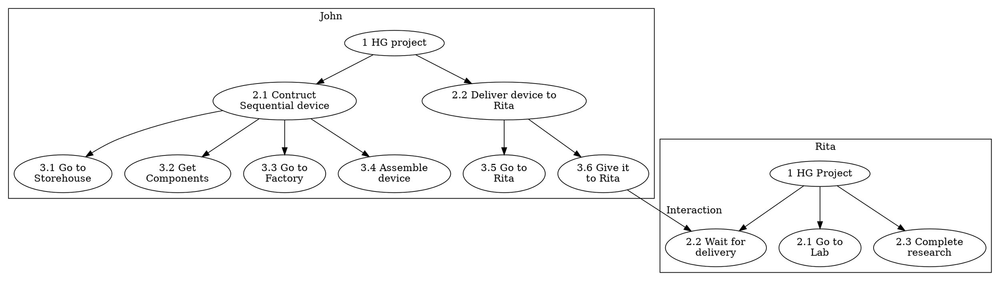

# Gameplay

The gameplay takes place on isometric view tile map set, when the player controls his avatar-character through the point-and-click mechanics to explore big open world.

The map consists of a number of objects including elements of terrain landscape, plants, cliffs, rivers, etc, and the elements of the build facilities such as buildings, various engineering constructions, bridges, tunnels, roads, habitation domes, transportation vehicles including trains and many other.

All elements of the map procedurally generated based on a number of a smaller predefined components such as walls, rooves, interrior objects etc.

The player is able to step into the buildings and its' rooms, interact with objects inside the buildings including electronic devices, computers, control panels, buttons, leverages, mechanisms, elevators, books, and some other small objects. He can read texts and messages found in books and devices, and keep them as notes in the UI.

There is one primary map in the game where the main action taking place and available for exploring by the player's controller character, and several independent small maps for side quests. The player is able to use vehicals to move between maps, and also to travel inside a single map faster. An example of such transportations could be, for example, ships to travel by water from the Island to the mainland, a Spacecraft to travel to the moon and back, and the monorail train to travel on the Island's map.

The primary game map is a tropical Island. In the beginnig of the game the Island map is already developed. The player and the commmunity of characters are keep developing and evolving it until another point of time from which they will relocate to the map of the Moon site with the different set of content, to establish moon base from scratch. For details see [Plot and Setting](#plot-and-setting) section.

All permanent non-playable characters in the game are completely independent and procedurally generated units that have the same capabilities as the playable character does. They live their own life in the game world, and interacting to each other as well as to the playable character, and the same way the playable character does. Both playable and non-playable characters can initiate dialogues to each other, take part in quests, building up social relationships, assembling new buildings, facilities and goods, advancing researches and economics of the game. The non-playable characters are driven by the game AI simulation models.

The overlall number of the non-playable characters actively simualted by the primary game AI is around a hundred of units. But the game engine also simulates more units that reveals on the map temporary from time to time, and not available for interaction. They perform direct predefined scenario driven actions only or is a part of the environment. Example of such units are robots, animals, the temporary visitors of the Island and the storytelling characters.

The list of base actions that simulated NPCs can do are:
 - Walking to specific place on map by foot, using vehicals or any other transportations.
 - Getting an object to be delivered to another place.
 - Applying the object to the target place, facility or giving it to another agent.
 - Getting a construction device.
 - Working with specific facility. This includes assembling devices, vehicals, mechanisms. Also taking part in construction of the building, working on researches in labs etc.
 - Initiating conversation session with another agent to set or recieve directs, and to gether or to provide information.
 - Performing an everyday and regular objectives such as sleep, rest, recreation, medical examinations, etc.

The dialog options and the quests are not predefined(except a few storytelling events), and completely based on the current gameplay situation that dynamically changing.

The primary ways of walking thought the game are:
 - By interacting with other NPCs, understanding connections between them based on gathered data and influencing characters through dialogs and quest completion to achieve desirable goals.
 - Leveling up personal skills, but also helping other characters to level up their skills to.
 - Taking part in research and engineering projects and/or organizing own projects.
 - Taking part in existing "tribes" and/or organizing a new one.
 - Building up personal political influence, and changing the overall characters community policy in various ways.
 - Technological progression of the overal community.

Any forms of fight interactions or violance mechanics are missing in the game. The game is primary focuses on social interactions and development of the game world in a purely peaceful way.

## Game AI Model

As was mentioned [ealier](#solution) non-playable characters should be able to interact to each other autonomously from the player, unite into groups to organize common tasks and to evolve the game world in general. All NPCs can make decisions based only on their personal traits and the information they can gether from the game world during their life experience in the game. So the NPC is, broadly speaking, in the same boat as the playable character.

All non-playable characters represent a set of *game agents*.  For the sake of simplicity we will call both playable and non-playable characters as *agents*. Both have the same set of base characteristics and interaction options and are equal from the game mechnics point of view. In general, NPCs don't distinct between the player's controlled character and other NPCs when they interact to each other. The differences are only in the way of control: the playable character actions are driven by a player, and NPCs are driven by the game AI.

Agent's actual actions are driven by the Task Tree Framework.

### Task Tree Framework

Each AI controlled agent has a set of tasks that it wants to perform. The set of tasks shaping a tree of tasks when each subnode represents a subtask required to be performed to accomplish a supertask's goal. Every subtask has a priority from it's supertask prospective. The leaf tasks contain actual elementary actions need to be executed to accomplish it's supertask.

Let's assume the following simplified example of task trees of two agents John and Rita working on a common "Human-Genome" project:

Once all steps are finished the project is done. But certain things could happen that will interrupt this process. For example, once John arrives Storehouse he realizes that it runs out of required components. Or Rita decided to join another project in the middle of the process. In such cases the agent starts re-evaluating of his tasks tree based on collected information.

The task tree can be seen as a decision-action tree that represents a "program" of the agent actions.

### Tree Evaluation Process

The nodes of the tree built up from a set of predefined *node types* that could be stacked together based on the match requirements. Matching requirements determined by the gameplay models and rules sealed inside particular node implementation algorithm and could vary based on the agent previous experience.

Once the node task failed or interrupted, the algorithm is trying to re-evaluate a subtree from the parent task. If the parent task cannot be evaluated to required conditions in a new circumstances, the algorithm re-evaluates the next parent subtree up to the root.

## Agent Profile

Each *game agent* has a set of attributes that defines character's role in the game world, unique behavior, personal preferences, strengths and weaknesses, communication and work skills, capabilities in social interactions, etc.

The set of base agent unit attributes are always public to all agents:

  | Attribute | Description |
  | -- | -- |
  | Location on the map | Coordinates on the current game map |
  | Residence place | House or apartment the agent lives in |
  | Current role/position in the project | The agent can take a part in only one project at a time |
  | Current political role | Official management functions in the overall community |

Other profile attributes are hidden for other agents by default, and some even hidden for the agent himself, but could be described. Hidden profile attributes exploration is a key in the primary gameplay mechanics that drives game simulation and progression.

Hidden attributes divided into three groups: agent skills that the agent is leveling up, communication traits, and behavior traits. Traits are permanent most of the time, but some of them can slightly change by the storyline events and by the projects completion too.

### Skills

They affect the efficiency of the agent when he is working on specific task in the project or talk to other agents.

There is a number of professions required to complete the project. Exact set of professions available in the game is defined by the currently discovered projects. Some professions are shared across several projects, and some are unique. These traits are hidden to other agents by default. Each agent in theory can do any work in the project, but the effeciency can differ significantly. The details on the projects and the gameplay economics model described in the next section.

  | Skill | Function |
  | -- | -- |
  | Base communication skill level | Defines the ability of the agent to simulate any emotional traits that don't belong to his profile. This skill is leveling up when the agent reaches desirable goals in conversation session with another agent. |
  | Level of professional skills | Individual level of skill defines speed of the task completion. When the agent works on the task, the relevant skills are leveling up once the task completed successfully. Means that the agent prefers working on the tasks based on his skills. And other agents may want to engage the most suitable agent based on their known skills to the project. |
  | Professional skill leveling curves | Agents may have different learning curves. For example, for some it's easier to level up in the beginning, but harded to progress later stages. The learning curve is defined by a formula with unique factors. These factors are static for the whole agent's lifetime. Also these factors are hidden for the agent himself too. So the agent doesn't know even his own potential strength and weaknesses too. But he(and other agents too) is able to guess it during a set of tries. The guessing algorthim of the personal skills is based on polynomial approximation. Also there is one project allows to reveal leveling curves for all agents at once. |

### Emotional Profile

This set of discrete relay traits represents emotional nuanses of speach and behavior in communicating with other agents. They affect agent's communication capabilities only, and don't affect any functional aspects. The more emotional traits match between two agents the more chance they come into arrangment in conversation. In other words the agents with closer Emotional Profiles tend to understand better each other by default. Also the agent is able to slowly learn other agents emotional traits he speaks to, and as such he can adjust his way of communication individually to grow his influence.

  - Politeness / Rudeness
  - Optimistic / Pessimistic
  - Cheerful / Moody
  - Verbose / Concise
  - Idealist / Realist

### Behavior Traits

Various scale characterisitcs measuring behavior functions of the agent that affect agent's task priorities and decision making.

  | Trait | Function |
  | -- | -- |
  | Solidity/Agility scale | Measures the ability of the agent to stick with initially choosen plan regardless of the changing circumstances. This measurement applies to the technical goals only. |
  | Morale scale | Same as Solidity, but in the opposite to Solidity it applies to the human relations. In other words this scale estimates the trustworthy of the agent in long-term cooperations. |
  | Secretivity scale | Estimates whether the agent tends to keep valuable information hidden to the agents he doesn't trust well. |
  | Introvert/Extrovert scale | Introverts tend to level up their own skills and to learn their own skill curves at first place. Extroverts tend to learn other agent traits, and relationships between agents. |
  | Empathy scale | Defines speed in learning of other agent *Emotional Profiles* during conversations, and the speed of the base communication skill leveling up. |
  | Altruism/Egoism scale | Altruists tend to make decisions in controversial situations to help other agents reaching their goals. Egoists care about their personal goals at first place. |
  | Comfort/Ascetism scale | How much the agent values a quality of life. This aspect influences the desirability of the agent to support initiatives and projects aiming to increase the common community wellfare as well as his own quality of life. |

## Communication Model

There are two ways of information distribution between agents:

  1. Public distibution through the news digest.
  2. Personal private conversation between two agents.

