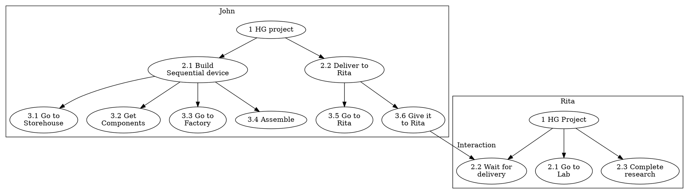

# Gameplay

The gameplay takes place on isometric view tile map set, when the player controls his avatar-character through the point-and-click to explore big open world.

The map consists of a number of objects including elements of terrain landscape, plants, cliffs, rivers, etc, and the elements of the build facilities such as buildings, various engineering constructions, bridges, tunnels, roads, habitation domes, transportation vehicles including trains and many other.

All elements of the map procedurally generated based on a number of a smaller predefined components such as walls, rooves, interrior objects etc.

The player is able to step into the buildings and its' rooms, interact with objects inside the buildings including electronic devices, computers, control panels, buttons, leverages, mechanisms, elevators, books, and some other small objects. He can read texts and messages found in books and devices, and keep them as notes in the UI.

There are several independent maps in the game available for exploring. The player is able to use vehicals to move between maps, and also to travel inside a single map faster. An example of such transportations could be, for example, ships to travel by water from the Island to the mainland, a Spacecraft to travel to the moon and back, and the monorail train to travel on the Island's map.

Once the player's character approaches some NPC he is able to initiate dialog with the player.

In contrast to classic RPGs the player doesn't have any forms of skills that he can level up. The primary way of walking thought the game is by interacting with other NPCs through dialogs, understanding connections between characters based on collected information and connecting characters in right way to achieve desirable goals.

Any forms of fight interactions or violance mechanics are also missing in the game. The game is primary focuses on social interactions and development of the game world in a purely peaceful way.

## Game AI Model

As was mentioned [ealier](#solution) non-playable characters should be able to interact to each other autonomously from the player, unite into groups to organize common projects and to evolve the game world in general.

All non-playable characters represent a set of *game agents*. Each agent has a set of tasks that it wants to perform. The set of tasks forming a tree of tasks when each subnode representing a subtask required to be performed to accomplish a supertask's goal. Every subtask has a priority from it's supertask prospective. The leaf tasks contain actual elementary actions need to be executed to accomplish it's supertask.

Similarly to the player actions, the list of actions for NPC agent include:
 - Walking to specific place on map by foot, using vehicals or any other transportations.
 - Getting an object to be delivered to another place.
 - Applying the object to the target place, facility or giving it to another agent.
 - Getting a construction device.
 - Performing a work with specific facility. This includes assembling devices, vehicals, mechanisms. Taking part in construction of the building, working on researches in labs etc.
 - Conversation with another agent to set or recieve directs, or to gether information.
 - Performing an everyday and regular objectives such as sleep, rest, recreation, medical examinations, etc.

Let's assume the following simplified example of task trees of two agents John and Rita working on a common "Human-Genome" project:

Once all steps are finished the project is done. But certain things could happen that will interrupt this process. For example, once John arrives Storehouse he realizes that it runs out of required components. Or Rita decided to join another project in the middle of the process. In such cases the agent starts re-evaluating of his tasks tree based on collected information.

The task tree can be seen as a decision-action tree that represents a "program" of the agent actions. The nodes of the tree built up from a large set of predefined components that could be stacked together based on their features. Some of the features are sealed, another components are varying based on information gathered by the agent. For instance, `Go to <place>` node must always be a leaf node. This is a sealed feature. However, the choice between two similar places is an option. Like, there are two Storehouses containing two similar sets of required components. And the agent knows from his history that it more likely for him to get success if he went to the second Store.

For each node there is predefined set of success conditions that include timeframe of completion and other metrics too. Once the node task failed or interrupted it tries to re-evaluate a subtree from the parent task. If the parent task cannot be evaluated to required conditions in a new circumstances cannot be met, the algorithm re-evaluates the next parent subtree up to the root.

Subtree evaluation process is based on genetic algorithm stacking all possible subnodes together. The node set and their stacking options(both sealed and varying) are representing [L-System](https://en.wikipedia.org/wiki/L-system) grammar. The genetic algoithm uses the current subtree root node goals and circumstances as a target function.

The information that the agent can use when he makes a decision is completely based on his personal life experience in the game world and also personal character skills too. So the NPC is, broadly speaking, in the same boat as the playable character. Despite the fact that all game agents sharing the same set of task nodes to build up their task trees, the variying features of each nodes adjusted during their walkthrough experience and continuously adjusting accordingly. As such it makes each NPC behavior unique too.

## Social Model

