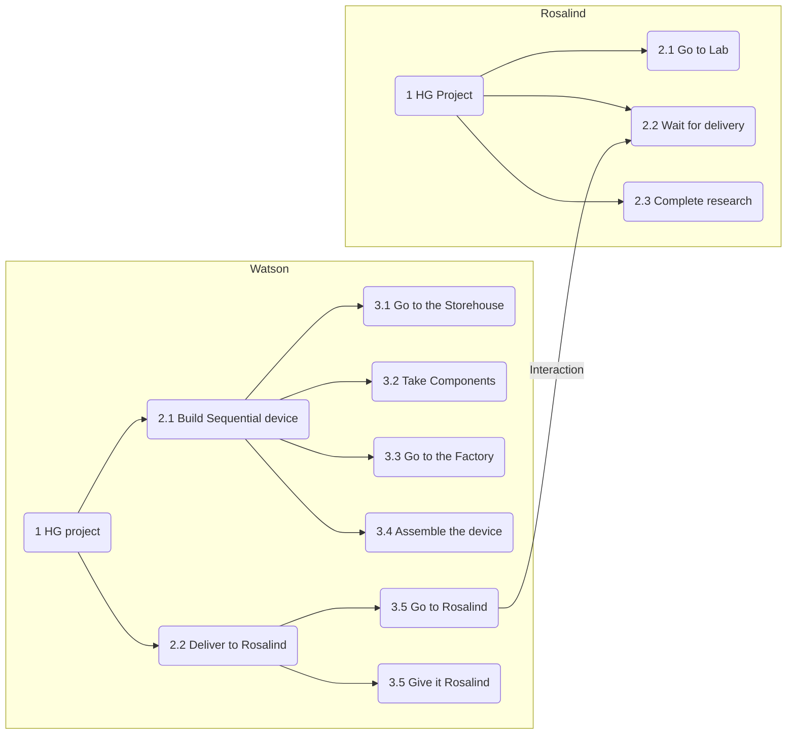

# Gameplay Mechanics

The gameplay takes place on isometric view tile map set, when the player controls his avatar-character through the point-and-click to explore big open world.

The map consists of a number of objects including elements of terrain landscape, plants, cliffs, rivers, etc, and the elements of the build facilities such as buildings, various engineering constructions, bridges, tunnels, roads, habitation domes, transportation vehicles including trains and many other.

All elements of the map procedurally generated based on a number of a smaller predefined components such as walls, rooves, interrior objects etc.

The player is able to step into the buildings and its' rooms, interact with objects inside the buildings including electronic devices, computers, control panels, buttons, leverages, mechanisms, elevators, books, and some other small objects. He can read texts and messages found in books and devices, and keep them as notes in the UI.

There are several independent maps in the game available for exploring. The player is able to use vehicals to move between maps, and also to travel inside a single map faster. An example of such transportations could be, for example, ships to travel by water from the Island to the mainland, a Spacecraft to travel to the moon and back, and the monorail train to travel on the Island's map.

Once the player's character approaches some NPC he is able to initiate dialog with the player.

In contrast to classic RPGs the player doesn't have any forms of skills that he can level up, nor a pocket of personal stuff to be used in quests. The primary way of walking thought the game is by interacting with other NPCs through dialogs, understanding connections between characters based on collected information and connecting characters in right way to achieve desirable goals.

Any forms of fight interactions or violance mechanics are also missing in the game. The game is primary focuses on social interactions and development of the game world in a purely peaceful way.

## Social Interaction Model

As was mentioned [ealier](#solution) non-playable characters should be able to interact to each other autonomously from the player, unite into groups to organize common projects and to evolve the game world in general.

All non-playable characters represent a set of *agents*. Each agent has a set of tasks that it wants to perform. The set of tasks forming a tree of tasks when each subnode representing a subtask required to be performed to accomplish a supertask's goal. Every subtask has a priority from it's supertask prospective. The leaf tasks contain actual goals need to be executed to accomplish this task.

An example of the task trees of two agents James and Rosalind working on a common "Human-Genome" project:

 some text