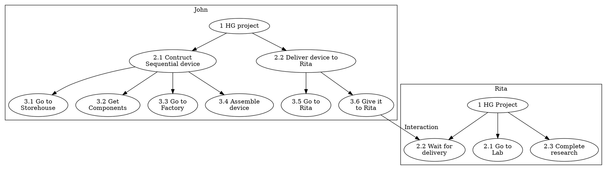

## Game AI Model

As was mentioned [ealier](#solution-overview) non-playable characters should be able to interact with each other autonomously from the player control, unite into groups to organize common tasks and to evolve the game world in general. All NPCs can make decisions based only on their personal traits and information they can collect from the game world during their life experience in the game. So the NPC is, broadly speaking, in the same boat as the playable character.

All non-playable characters represent a set of *game agents*. For the sake of simplicity, we will call both playable and non-playable characters as *agents*. Both have the same set of base characteristics and interaction options and are equal from the game mechanics point of view. In general, NPCs don't distinguish between the player's controlled character and other NPCs when they interact with each other. The differences are only in the way of control: the playable character actions are driven by a player, and NPCs are driven by the game AI.

The agent's actual actions are driven by the Task Tree Framework.

### Task Tree Framework

Each AI-controlled agent has a set of tasks that it wants to perform. The set of tasks shaping a tree of tasks when each subnode represents a subtask required to be performed to accomplish a supertask's goal. Every subtask has a priority from its supertask context. The leaf tasks contain actual elementary actions that need to be executed to accomplish its supertask.

Let's assume the following simplified example of task trees of two agents John and Rita working on a common "Human-Genome" project:

Once all steps are finished the project is done. But certain things could happen that will interrupt this process. For example, once John arrives at the Storehouse he realizes that it runs out of required components. Or Rita decided to join another project in the middle of the process. In such cases, the agent starts re-evaluating his tasks tree based on collected information.

The task tree can be seen as a decision-action tree that represents a "program" of the agent's actions.

### Tree Evaluation Process

The nodes of the tree built up from a set of predefined *node types* that implement actual elements of the gameplay mechanics and could be stacked together based on the match requirements. Matching requirements determined by the gameplay models and rules sealed inside a particular node implementation algorithm and could vary based on the agent previous experience.

Once the node task failed or interrupted, the algorithm is trying to re-evaluate a subtree from the parent task. If the parent task cannot be evaluated to required conditions in new circumstances, the algorithm re-evaluates the next parent subtree up to the root.
