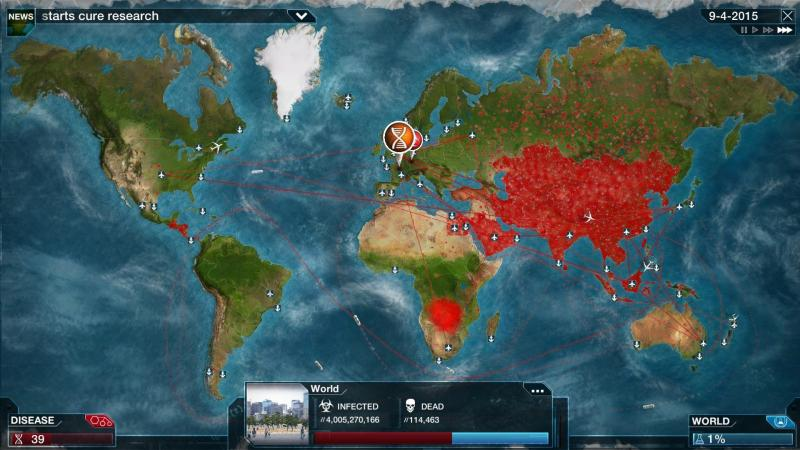

## Political Model

The Government of the community consists of several game agents called *Academicians* who gain their positions through the primary election process. The Academician status is life-long and can be taken away by decision of the other members of Government only. The number of academician positions is strictly limited, so the new Academician can be elected only when someone else leaves his position.

All political processes, votes and decisions made by the Government are public for the entire community. This information can be used by Extravert agents to reveal outlier actions of the government and discover other clan strctures and it's influence power.

### Election and Resignation

Any agent in the game taking a part in election in both candidate and voter roles. Each agent has only one vote he can give to any other agent except himself.

The members of the clans are voting either for their Leaders or for the candidate set by their Leaders. Loner agents are voting based on candidate general public reputation and personal attitudes. The candidate who took larger number of votes than the other candidates will gain Academician status. The voting process is public, so each agent knows who were supporters of a candidate.

Resignation is a rare event that could happen only when Academician looses his public reputation dramatically. In this case other academicians can vote against him to take away his position. If there are more than 3/4 votes aganist the agent, he loses his status. Loner Academician agents are voting based on public reputation metric and personal attitude too, whereas clan members can keep supporting their member regardless of these factors. Resignation votes are also public.

### Government functions

From the gameplay point of view the Government responsible for the following two functions:
  - Making decisions to invest resources in the new projects. To support the project more than 1/2 of the Government members should vote for the project.
  - Election of the community *Governor*. The Governor is elected from one of Academicians every few years by the most of the votes.

Governor has a power to replace any Infrastructure System Administrator at any time. And is managing the foreign policy.

### Foreign policy and international trading

Until the community internal economics reaches self-sufficient status(through the set of advanced projects) it has to keep getting various material resources from the external world required for establishing new projects and to support existing infrastructure.

Resource gethering implemented in a form of a mini-game set on political map of the world with the game mechanics similar to the [Plague Inc](https://store.steampowered.com/app/246620/Plague_Inc_Evolved/).

Each country on the map has:
  - Particular number of Foundation divisions deployed in the country.
  - The estimation of the country level of development.
  - Country counter-espionage power.

Foundation divisions providing Foundation with resources they are gathering in each country automatically. Total amount of resources that can be yield from the country proportional to the number of divisions deployed in the country and the country development level, but inverse to the country counter-espionage power. And the total number of resources available for community is summing up from all country yields.

Country's counter-espionage is growing slowly depending on the country level of development.

Governor has two ways to influence the foreign policy:
  - By deploying results of Foundation research projects through the network of divisions in particular country.
  - By deploying false peudo-scientific ideas.

Once true results of the finished project deployed to any country, it opens new types of resources for import required to develop the next projects. Also it increases a number of Foundation Divisions in that country, and the country level of development in time too. As such it increases Foundation resource yield from that country for a while. The negative effect of this action is that counter-espionage power of the country starts growing faster as well. Also, eventually the level of development and counter-espionage boost spreading into other countries.

However, even if the Governor doesn't deploy any true technology results, one of the top developed countries will eventually make the breakthrough themself, openning new types of resources, increasing it's development, counter-espionage power and spread these effect to other countries in time, but this event will not increase the number of Foundation divisions in any country.

When the counter-espionage level in the country exceeds critical level, the number of divisions start decreasing faster and faster. Once all divisions in the country exceeded and if the community didn't build moon base and self-sufficient economy by that time, the game ends.

Governor can temporary slow down counter-espionage effect and the country development level natural grow by either deploying more results of the Foundation researches, or by deploying false pseudo-science ideas. The false ideas becoming available to use from time to time when some set of true researches already done by Foundation. Each available false idea can be deployed only once in a single country, and it temporary slows down the country development grow and it's counter-espionage grow too. This effect spreads to other countries eventually.

Some technology deployments can provoke countries to declare war, or even provoking the world war. The war always slows down country development progress, but also decreases a number of Foundation divisions in the country and increases counter-espionage power. Such events may significantly decrease Governor's general public reputation and can lead to his resignation.
