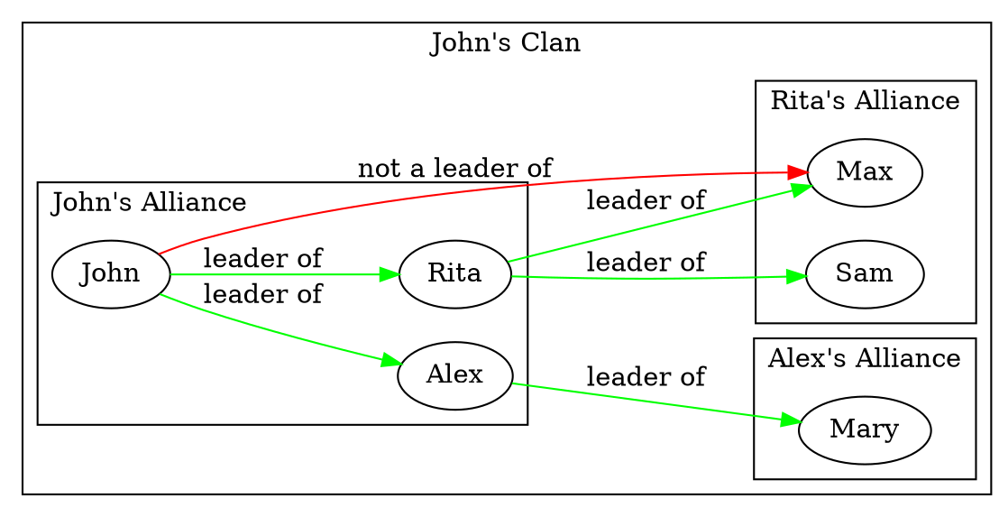

## Social Model

There are three base personal priorities that define agent's goals:
  1. __Personal breakthrough.__ Breakthrough mechanics will be described in more details in the next section, but if the agent has a breakthrough idea, it's implementation becomes his top priority.
  2. __Clan power grow.__ Some of the agents establishing secret permanent alliances of interests between each other to work on the common goals. The network of alliances shape hierarchical clans that compete to each other. If the agent belong to a clan, clan's power is the second priority among other things.
  3. __General community progress.__ Any initiatives and events that can move the overall community progress forward from the agent traits and skills point of view and don't contradict other priorities will be supported by the agent.

### Alliances and Clans

Each agent has a map of trust towards other agents that is based on the history of cooperations between them. If the history of cooperation was success and stable in long-term there is a chance they become permanent allies. The *Alliances* between agents is a key concept of this mechanics. It's core idea loosely mimics the concepts of the [European Medieval Feudalism](https://en.wikipedia.org/wiki/Feudalism) and [Japanese Samurai Institution](https://en.wikipedia.org/wiki/Bushido), but also reflects similar constructions that exist in the modern societies as well.

In the alliances of two agents there is a *Leader agent* who establishing goals and strategies of the alliance and a *Supporter agent* who supports and implements the strategy. Both Leader and Supporter agents have a high level of trust and they can broadly share any information between each other. There could be several Supporter agents of one Leader, but the Supporter agent may have only one Leader. The Supporter agent can also establish his own alliances with other agents where he plays the lead role toward them. The Supporter of the Supporter, however, doesn't obey the first supporter's leadership will directly, but the first supporter can use his own mastership network to support his leader's goals. Since that the general stretegy of this hierarchy called a *Clan* is steady, but implementation tactics could vary a lot depending on the depth of hierarchy, and even corrupt in the leaves.

The leadership relations of the clan tend to be quite stable in long term due to several factors:
  - Both Leader and Supporter trust each other per se due to cooperation causes preceed of their alliance.
  - The agents with high *Extravert* traits tend to research other agents' traits carefully, so they tend to establish alliances with trustworthy agents only. So the clans passes test of time tend to be stable as well.
  - The agents with high *Intraver*, *Morale* and *Altruism* traits tend to become leaf supporters of the clans, but they could gain protection and support from the clan of their personal interest in the game.
  - If the Supporter betrays his Leader, it affects his reputation in overall community as a "clan player" who couldn't be trusted. Then there is a least chance he will become a part of the stable clan again in supporter's role, because no one will trust him again. However, such causes may rarely happen if the clan becomes too unstable due to new circumstances, or because of significant changes in personal priorities of the agent.

The Leader tend to protect his alies, and the clan tend to protect all of his members as a brotherhood to keep overall power of the Clan. This is a primary benefit for the supporting role of the members of the clan. If the Supporter agent breaks the alliance with his Leader, he becomes a top Leader of the new clan. And as a leader of the new clan he is loosing his previous clan overall protection, and should be well prepared to compete with other clans.

In general clan's power defined by the number of members, their skills and reputation, formal roles of the members in the projects, and overall amount of Foundation resource the clan controls through it's members. Clan's general strategy defined by it's top Leader and implementing through the series of directives down the hierarchy tree.

To compete to other clans the clan can use a wide number of instruments including promotion of it's members based on their skills to prospective projects, promotion the members to the government administrative roles, boosting public reputation of it's members, recruiting new members, and preventing the similar action of it's competitor clans.

Due to differences in personal profile traits and skills not all members can become good players of the clan system. As such many of the agents in the game don't belong to any clan. There are a lot of *Loners* who work on their own. However they could be useful in the clan competition strategies. For example, if one loner has advanced skills in specific field important for prospective project, the clan members will try to involve him in the project, and could even compete to each other to hire him.

The allies hierarchies between members and the clans themselve are "unofficial" terms. These types of relations are completely hidden to other agents by default. The structure of the clan even hidden to it's members. So understanding the social structure and it's dynamics prediction is important challange on all steps of the game evolution. The agents with high Extravert traits tend to be more efficient in this process. They use various prediction approaches based on information they could gain from two sources:

1. If the agent is a member of the clan already, he could ask for his Leader and Supporter of their relations with other agents directly, and to gain accurate information.
2. The agent could also try to gather information from the one-to-one conversation with any other agent in the game and through the public events research. And if he sees statistical outliers in the gathered data, he can put corrections in his own imagination of the social relations model. The more efforts the agent invests in this activity the more accurate his understanding of the model is.

Because there is no single source of truth, agent's understanding of the social model accuracy may vary. Since of that the agents with high *Extravert* skills and *Morale* are capable to establish stable clans and play clan competition games efficiently. However, clans overall power depends on the wide range of traits and skills of it's members, so the clan assembling balance is always a challenge to the NPC agents and the human-controlled character both.

Also it's worth to be mentioned that the clan's "formal" roles in the game are not necessary correlate to the agents' actual alliance hierarchies. Members of a single clan could be members of the different projects depending on the clan's strategy. Moreover Supporter and Leader could take irrelevant roles even in a single project or in the Foundation government. The clan can promote it's members based on their actual skills and public reputation, but the secret hierarchies inside the clan.

### Loners

The ordinary game agents who are not members of any clan can build different strategies of personal grow depending on their skills and the trait combinations. But, in general, they appear to be "pawns" in the hands of the clan's competition game.

*Loners* behavior determined by their Agent Profiles quite straightforward. They don't establishing permanent strategic alliances, however they could temporary cooperate based on two factors:
1. __Agent's public reputation.__ Gained through the projects successful participations, scientific researches and The Journal of Foundation publications. The higher reputation agent has the more chance he get support in personal requests from the stranger, receive positive resolution for his initiatives from the government, and will gain more votes in the government election.
2. __Agent's personal reputation.__ Agents with high Altruistic trait tend to help other agents in their requests. These actions affect agent's trustworthy in personal communications.

### Clans versus Loners strategies analysis

The primary advantage of playing in a clan stems from cooperation effect. If the clan is well-organized, has a high power in community, and has skilled members, it is capable to forward any project faster and more efficiently than the other clans and disorganized loners do. And as a result can grow it's own power, resources, and can gain benefits for it's members in skills and reputation both.

However, clan competitions have certain disadvantages too:
1. On the clan competition level the process represents non-cooperative game. As such it may lead to the [Nash equilibrium](https://en.wikipedia.org/wiki/Nash_equilibrium) and the overall game stagnation. Nash equlibriums, however, can be broken by non systematic factors: personal scientific Breakthroughs, through the storytelling events and by the player's inordinary actions.
2. Clan's resources could be shorter than particular agent needs, so his personal grow may be slower than if he would be a loner. In practice, some highly skilled and talanted Intravert agents may be interested in playing as a loner sometimes. Nevertheless, if there is too many of such agents and no clans in the game, they will be unable to implement their goals due to disability in cooperation.
