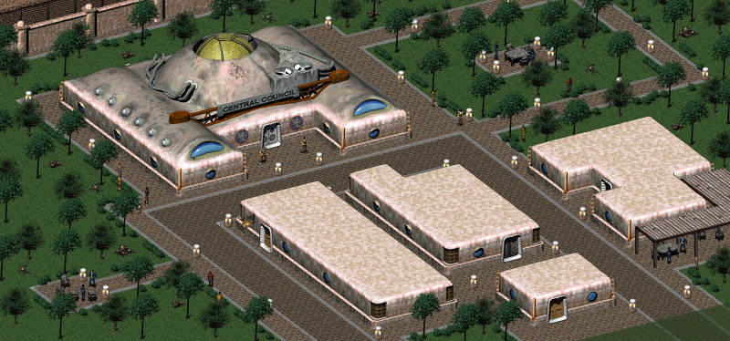
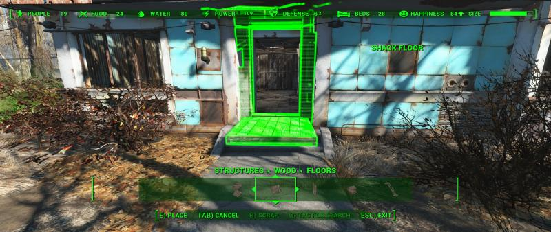
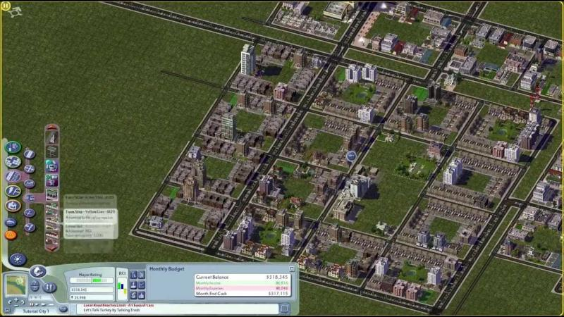

# Motivation

## Problem Overview

Being a big fan of the classic role playing games such as Fallout series and The Elder Scrolls I'm thinking about evolution of the genre. The core idea standing behind RPG is to explore big open world, discovering new places, meeting new characters, understanding connections between them, learning attractive storyline, and eventually assembling the puzzle of intersecting storytelling quests to rule the world. One of the primary motivation for the player is to build the avatar character for whom he plays whatever role he imaging through the system of leveling up of various skills and collecting unique game stuff. Starting from the nomad of no-name, but eventually becoming the greatest hero.

This form of game mechanic is very attractive because it creates an illusion of dynamically evolving world letting the player to take a part of it. However, once the player studied the game universe he starts realizing that the world is actually static. Whatever place he visits other non-human players play performance around the main character and for him personally. The player is able to change the plot based on decisions done in quests and dialogues, but a number of possible story branches is limited and eventually discovered completely. Such disappointment doesn't spoil the game per se, but it makes it lesser enjoyable than it could be if other characters would have their own freewill and could evolve independently too. Moreover, it could be even more attractive if other characters could be self-organizable, and be able to assamble new groups or tribes to do their own and unique stories, to manage communities themselve and even build new towns.

Let's take an example of the Vualt City from Fallout 2:

After the long journey through the post-apocalyptic wasteland consists of ruines and decadent surviving tribes, it is very impressive to encounter such miraculous well-built town. And even more impressive when the player realizes that it was built using super-power futuristic technology fitting just in a small case called GECK.

But what if the GECK wasn't completely exhausted by the Vault City citizens yet? What if they capable to keep developing the town, assembling new buildings and facilities, expanding town's territory, having continuous evolution of the community? I believe such thoughts come into mind to many players who walked through the game.

The later attempt towards this feature was presented in a sequel Fallout 4:

In Fallout 4 building mechanics was introduced as a mixture of Minecraft-like and tower-defense game mechanics, when the player is capable to build a small sattlement for a local community of NPCs to defend the community from raids and to grow it's primitive economics. What's bad about this approach, aside from the fact that the building components are not aligned by a grid, is:

1. Contrary to Minecraft a number of components and their possible forms is limited.
2. The player is also limited in a number of things he can rebuild inside the sattlement's borders. So the overall game world is still feeling static, and the manual build facility embeddings feel artificially too. The player is not able to reconstruct the entire game world as he does in Minecraft.
3. Despite the fact that NPCs are able to do some jobs on their own, their behavior is very primitive and is still mostly driven by predefined quest scenarios.
4. All facilities are built by the human player exclusively. Non-player characters are unable to design and develop.

As a result the game, in my opinion, feels incomplete as a building simulator and as a RPG both. And I think it was a direct consiquence of the mixture between game mechanics that don't fit well to each other. Even if Fallout 4 would be polished better, having blueprint like mechanics to design and develop buildings would feel boring and unnatural in RPG. Why? Because of the roots of these mechanics. Initially the idea of the blueprint-based control came from the strategy games. Both real-time strategies and city-building strategies.

In a strategy game the player has a full control over design of whatever he wants to build on the map. His only limits are common resources(that he also has a full control of) and the map layout limitations. But in general the player is capable to establish whatever he wants and whenever he wants to. So, what is the role of the player from the RPG point of view? A master of the in-game universe. He is no longer one of many between other NPC-units, he has a full control over them from the beginning. There is, generally speaking, no place for discovering and challanging individual characters as the player already rules them. As such attempts of direct embedding of strategical game mechanics into RPG games doesn't work.

## Solution

Instead of building in different game mechanics driven by the player, let's simulate them by a non-playable characters driven by the game's engine artificial intelligence. This approach presumes that AI should be smart enough to simulate social interaction between all characters on the high level of realism. Every NPC should be able to analyse current game state, game world evolution history and his own history of interaction with other players. And be able to make individual unique dicisions based on this analysis and the unique character properties. The AI-driven NPCs should also be able to do a short-term and long-term strategy planning, to unite into groups, and to perform actions agreed upon group to build common projects including building up facilities, economics and politics, organizing production lines etc.

And the human-playable character can also influence these processes changing their direction in desirable way through dialogs with other characters, and by the quests completion. As such the gameplay should feel natural for the classic RPG set, but becomes much more deep and advanced once the player starts realizing gameplay mechanics and opening possibilitis. Building up the right relations between other characters, understanding their motives, strengths and weaknesses allows the player eventually reconstruct entire game world universe the way he wants to without the use of blueprints and other strategy games ordinary gameplay instruments.

This approach seem to be hard to achieve on acceptable level of realism for a first glance, but is doable when the model of interaction is well thought and designed. Such models will be described in the next sections of this Document.

Also it's worth to mention that this approach is not new. Attempts towards this idea in more trivial form were introduced in some modern games including The Guild game series.
