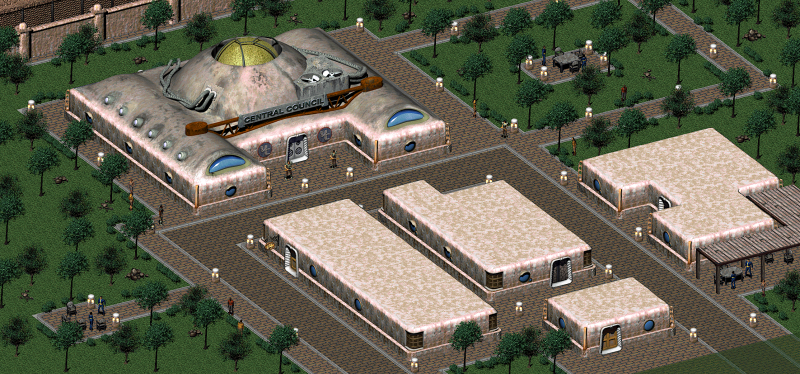

# Motivation

## Problem Overview

Being a big fan of the classic role playing games such as Fallout series and The Elder Scrolls I'm thinking about evolution of the genre. The core idea standing behind RPG is to explore big open world, discovering new places, meeting new characters, understanding connections between them, learning attractive storyline, and eventually assembling the puzzle of intersecting storyline quests to rule the game world. One of the primary motivation for the player is to build an avatar character for whom he plays whatever role he imaging through the system of leveling up of various skills and collecting unique game stuff. Starting from the nomad of no-name, but eventually becoming the greatest hero.

This form of game mechanic is very attractive because it creates an illusion of dynamically evolving world letting the player taking a part of it. However, once the player studied game universe completely, he starts realizing that the world is actually static. Whatever place he visits other non-human players play a performance around the main character and personally for him. The player is able to change the plot based on decisions done in quests and dialogues, but a number of possible story branches is limited and eventually discovered completely. Such disappointment doesn't spoil the game per se, but it makes it lesser enjoyable than it could be if other characters would have their own freewill and could evolve independently too. Moreover, it could be even more attractive if other characters could be self-organizable, and be able to assamble new groups or tribes to do their own and unique stories, to manage communities themselve and even build new towns.

Let's take an example of the Vualt City from Fallout 2:

After a long journey through the post-apocalyptic wasteland consisting of ruines and decadent surviving tribes, it is very impressive to encounter such miraculous well-built town. And even more impressive when the player realizes that it was built using super-power futuristic technology fitting just in a small case called GECK.

But what if the GECK wasn't completely exhausted by the Vault City citizens yet? What if they capable to keep developing the town, assembling new buildings and facilities, expanding town's territory, having continuous evolution of the community? I believe such thoughts come into mind to many players who walked through the game.

The later attempt towards this feature was presented in a sequel Fallout 4:

In Fallout 4 building mechanics were introduced as a mixture of Minecraft-like and tower-defense game mechanics, when the player can build a small sattlement for a local community of NPCs to defend them from raids and to grow it's trivial economics too. What's bad about this approach, aside from the fact that the building components are not aligned by a grid, is:

1. Contrary to Minecraft a number of components and their possible forms is limited.
2. The player is also limited in a number of things he can rebuild inside the sattlement's borders. So the overall game world is still feeling static, and the manual build facility embeddings feel artificial too. The player is not able to reconstruct the entire game world as he does in Minecraft.
3. Despite the fact that NPCs are capable to do some jobs on their own, their behavior is very primitive and is still mostly driven by predefined quest scenarios.
4. All facilities are built by the human player exclusively. Non-playable characters are unable to design and develop.

As a result the game, in my opinion, feels incomplete as a building simulator and as a RPG both. And I think it was a direct consiquence of the mixture between game mechanics that don't fit well to each other. Even if Fallout 4 would be polished better, having blueprint-like mechanics to design and develop buildings would still feels boring and unnatural in RPG. Why? Because of the roots of these mechanics. Initially the idea of the blueprint-based control came from the strategy games. Both real-time strategies and city-building strategies.

In a strategy game the player has a full control over design of whatever he wants to build on the map. His only limits are common resources(that he also has a full control of) and the map space for building layout limitations. But in general the player is capable to establish whatever he wants and whenever he wants to. So, what is the role of the player from the RPG point of view? A master of the in-game universe. He is no longer one of many between other NPC-units, he has a full control over them from the beginning. There is, generally speaking, no place for discovering and challanging individual characters as the player already rules them. As such attempts of direct embedding of strategical game mechanics into RPG games don't work.
