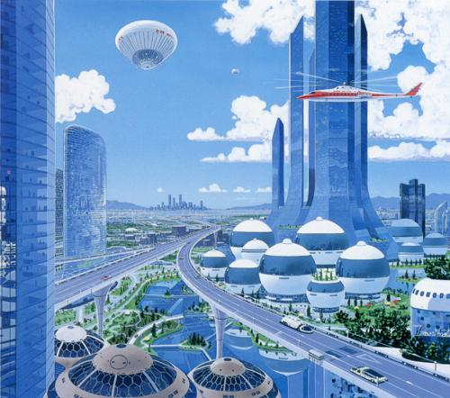

# Plot

## Backstory

The story line starts in the last decade of the XIX century. The secret conspiracy organization called *Foundation* was founded somewhere in the past of the XVIII century by a fictional character Alexander Ziolkowski, genious inventor, phylosophists and professor of mathematics who applied strict mathematics methods to scientifically proof the decline of the future civilization. To prevent catastrophy scenario and to rescue mankind from extinction, he established secret organization based on the strong principals of faith in science and technology advance, and in faith of the man freewill to achieve this advance through the freedom of thinking, creativity and the freedom from prejudice.

Ziolkowski idea was to select and unite the most talanted and extraordinary people all around the world, to become a new more advanced, liberal and humanity society that will be hidden from the rest of the world for a while, but one day reveal and lead the civilization.

To achieve their goals Foundation used to stick with certain organizational principals including conspiracy, hierarchical divsions and following a Code of Conduct. No one of the members know the rest of the members, only a few part of their working group. And only a few members of the top inner circle aware of the entire picture and involved in planning. Many of the members live normal life, have a family, friends, ordinary job, yet they also have secret life where they are taking part in Foundation's projects.

Foundation have extensive network of divisions around the world. All of the devisions are decorated as local firms, manufactures, banks and other organizations providing ordinary services, hiring labors unaware of Foundation. Usually only the top management and key persons are secret recruits of the organization. Thereby they are capable to perform instructions coming through the network of agents from the Foundation headquarters.

Due to the decenetralized nature of the Foundation organizational structure and high level of conspiracy, they are resistent to the most external threats, and have wide range of influence capabilities. However, Foundation doesn't use these capabilities to gain any forms of personal benefits for their members, or establishing world dominance. Their primary goal is to serve the pure knowledge and discovering secrets of nature. Since that Foundation's Code of Conduct forbids direct influention to the world policy and geopolitics. Instead they use their resources to secretly recruit new members by looking and patronaging for talanted children around the world regardless of their origins or social status, but based on their talants and potential. And letting them grow and realize their potential and creativity inside Foundation using their organization's resources.

By the virtue of this way Foundation has accumulated the most intelligent people around the world by the beginning of the XX century. And thanks to their genius they reached a number of significant scientific and engineering breakthroughs including such fields as Bioengineering, Medicine, Computer Systems, Aerospce Engineering and many other amazing achievements that outperform their generation for decades if not centuries.

Yet, despite their closeness and indifference to the external world fate, Foundation shared some of their knowledges and technologies in the past in order to gain material resources required for their research projects and organization's operational expenses. And some of their sharings had controversial consequences. Few know that a number of engineering breakthroughts in Great Britain in the XVIII were not developed, but revealed by secret members of Foundation. One consequence of this influence was beginning of the era of Industrial Revolution that eventually spreaded into other countries. Another, more frightening and dangerous consequence was a progress in military technology production that brought wars into a new level of violance, increasing human deaths worldwide multiple, and also indirectly damaging planet's ecology due to mass production polutions. These consequences outspoken controdicted of Foundation's humanity principals lying under the basis of their high goals set by Alexander Ziolkowski.

For some this was a clear evidance of self-fulfilling prophecy of Ziolkowski genius. Yet many were lesser sceptical which lead to even more tragical failed attempts in revealing of secrets of their knowledges in order to change the world for good, but everytime only increasing human suffering and death. Lessons were learned. Foundation became more caution and closed organization. However, whether they want it or not, the history continues to evolve. And eventually they will have to face the call of time that could destroy them and disclose their secrets brining the world to the point of a total disaster.

## The Island

Foundation established their central base long time ago on the lone isolated island somewhere in Pacific Ocean yet hidden and undiscovered by the rest of civilization. The Island is a bastion of entire organization, where Foundation do their key researches, collecting and storing results, building up research labs and facilities, providing scientific experiments. Strategic planning and it's divisions management, logistics and secret operations on the mainland is also in charge by the Headquarters built on the Island.

There is a whole town built on the Island using entire range of the top engineer thinking reached by Foundation scientists, engineers and inventors. There are research labs, administrative and utility buildings, entertainments, medicine centers, residencies for the Island's permanent habitants and guests. The city is powered by electricity based on Nuclear energy, has magnetic levitation trains transportation network, electrocars, helicopters, supercomputer centers and computer networks. There is even some level of robotisation and automation. Yet, having all set of technology advances and high standars of living comfort for it's habitants in XIX century that is comparable to the rest of civilzation XXI century future level of progress, the town's planning policy still carying of the Island ecology combining urban facilities and leaving space for nature grow. Thereby the Island scientists town is a high tech, but green city.

One of the most remarkable projects of Foundation is a Space program finished just recently. These are just first steps in the aerospace engineering field done by Foundation, but they already built a cosmodrome on the Island and successfully launched several space missions to set orbital satellites establishing transcontinental radio communication used by Foundation divisions and agents.

Another remarkable facility is a Palace of Science &ndash; Foundation Headquarters administrative building, a place of the Foundation high council assembly, and a central storage of knowledge of all Foundation's inventions and discoveries. This is a heart of entire organization, and the most guarded place.

With all glorious achievements of Foundation, the Island is not a self-sufficient colony. Town's internal economy and Foundation's projects are heavily tied to deliveries from the external world through the network of mainland divisions. This includes produce or buy all sort of multi-step production line intermediate components required for specific project, to the habitant everyday supplies. Thanks to the high level of security standards and well-organized logistic system between Foundation's world-wide network of divisions built-in into the local regional economics of countries, Foundation is able to organize high technology mass production in decentralized fashion, but still keeping it secure. Such as each division framed to a local manufacture, assembling or buying one specific component of production line and sending it to the next division on the opposite side of the world. But each local manufacture labors unable to see the big picture, and as such unaware of the purpose of specific detail they are assembling. To them it looks like just an ordinary production order like any other order they normally fulfill. All intermediate components eventually came to the Island where local habitants assembling them to the final product.

Despite the extra complexity of logistic system and security expanses of Foundation this approach was quite efficient in the past, when the external world technologies and economics were pure developed. Because contrary to the external world they utilized advanced production approaches such as mass production much earlier than the external world invented it too.

In a nowadays highly conspirated Foundation world-wide production system efficiency decreased dramatically. External civilization progress leads to grow of internaltional communications and trading. So, Foundation now has to spent up to 90-95% of it's world-wide divisions netwrok resources just to keep the system itself and the Island secure and hidden and preventing leakages. Foundation is now in stagnation and on the verge of crisis when they will not be able to maintain their conspiracy model, and eventually will be exposed.
