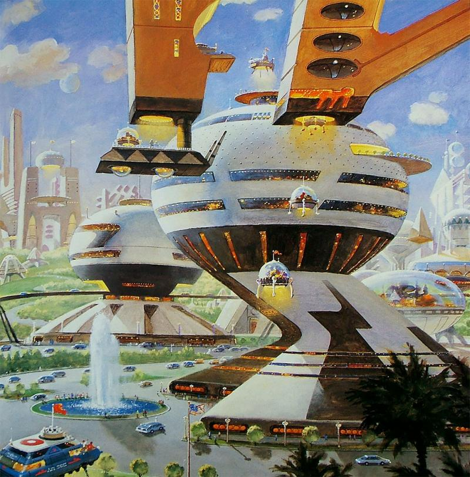

## Alexander Ziolkowski

Too few is known about Ziolkowski biography, nor about the first steps of Foundation establishing process. This information was erased for a reason. There is no end without beginning. Foundation was established to become an eternal force of the future civilization that will exist forever and will change humanity irreversibly. Specific names and personal cults don't make sense in context of the High Goal.

Yet, there are a few near speculative things about Ziolkowski that we know. He was born in a poor fisherman family of uncertain roots in the north of Russian Empire in the beginning of XVIII century, but demonstrated extraordinary talants in a wide range of fields from natural science to literature and arts from his childhood. He was never patronaged due to his lower social class belongingness, but thanks to his natural thirst to knowledge and the faith in his destiny, he gоt education in Russia, and later in Western Europe where he lived and worked for the rest of his life. Alexander Ziolkowski was a polymoth how did a number of breakthoughs including discovering atmosphere of Venus and asymmetric cryptography. But the most important one was discovering strict mathematic methods allowing prediction of the future of the human societies of the very high level of accuracy. As such the main prediction about the future civilization catastrophy decline was done, as well as prediction on the possible way of resolution through establishing Foundation.

Despite the strong mathematical proove of Ziolkowsky Theory and the high level of accuracy of it's predictions, there are a number of limitations:

1. The theory allows to predict evolution of the human society and the key events of it's history, it doesn't predict fate of a single person.
2. An accuracy of prediction violates if prediction become exposed before fulfillment. In other words early publishing of predictions changes history and makes prediction itself obsolete. As such it must be hidden for a while.
3. However, in certain situations it is possible to predict exact consequences of changes in history of the society done by a single speach spreaded across the society.

The second rule concludes that Ziolkowsky Theory itself must be hidden after the first application. Otherwise, it makes possible for someone else to re-apply it again and get the results of predictions revealed beforehand, making them effectively obsolete. Since of that the knowledge about the Theory was erased too.

Due to speculative nature of this story there are rumors that Alexander Ziolkowsky never existed at all, and there was a group of people working under a single pseudonym. There are even more mysterious believes that this group might still exist inside Foundation as even more conspirated society that secretly watching for Foundation and changes it's fate in the crucial moments of it's history.

Whether it's true or not, no one doubts Ziolkowsky predictions truth because of the "Book Of Alexander Ziolkowski" owned by Foundation.

The book consists of a set of chapters encrypted with assymetric cryptography methods. Decryption of each chapter requires decryption of the previous chapter first. And hardness of decryption increasing from chapter to chapter. The first chapters were decrypted manually, in a nowadays they decrypting by Foundation supercomputers. Has to be mentioned that decryption process itself tends to be one of the driver of computer technology researches inside Foundation. Averagely Foundation decrypting each new chapter once per 40-50 years. Each chapter succssful decryption event attracts attention of entire society, and the chapter usually contains two things:

1. It describes all remarkable events that happened with Foundation and the world for the previous period, including starting and ending of wars, exact changes in geopolitics, economics and technologies, exact results of succsess and fails in Foundation projects and operations. The description even contains quite short range of estimations of various metrics. And it never tells wrong information. Due to cryptography nature such results couldn't be falsify. And this is a clear and very impressive proovness of truth of the theory, and the plan and goal of Foundation for all members of the society.
2. The second part of the chapter provides some advices for the future. The advices are usully formulated in a loose form. They don't contain specific recommendations or plans, and usually presume different interpretations.

The book was a main source of believes and hopes of entire society for centuries since the beginning of Foundation.

