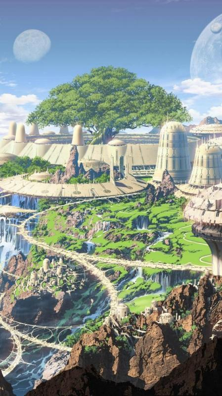
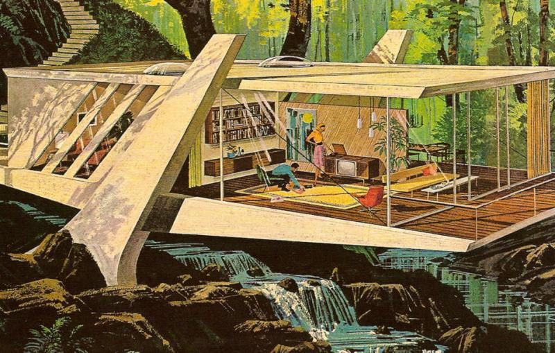

## The Island

Foundation established their central base long time ago on the lone isolated island somewhere in Pacific Ocean yet hidden and undiscovered by the rest of civilization. The Island is a bastion of entire organization, where Foundation do their key researches, collecting and storing results, building up research labs and facilities, providing scientific experiments. Strategic planning and it's divisions management, logistics and secret operations on the mainland is also in charge by the Headquarters built on the Island.

There is a whole town built on the Island using entire range of the top engineer thinking reached by Foundation scientists, engineers and inventors. There are research labs, administrative and utility buildings, entertainments, medicine centers, residencies for the Island's permanent habitants and guests. The city is powered by electricity based on Nuclear energy, has magnetic levitation trains transportation network, electrocars, helicopters, supercomputer centers and computer networks. There is even some level of robotisation and automation. Yet, having all set of technology advances and high standars of living comfort for it's habitants in XIX century that is comparable to the rest of civilzation XXI century future level of progress, the town's planning policy still carying of the Island ecology combining urban facilities and leaving space for nature grow. Thereby the Island scientists town is a high tech, but green city.

One of the most remarkable projects of Foundation is a Space program finished just recently. These are just first steps in the aerospace engineering field done by Foundation, but they already built a cosmodrome on the Island and successfully launched several space missions to set orbital satellites establishing transcontinental radio communication used by Foundation divisions and agents.

Another remarkable facility is a Palace of Science &ndash; Foundation Headquarters administrative building, a place of the Foundation high council assembly, and a central storage of knowledge of all Foundation's inventions and discoveries. This is a heart of entire organization, and the most guarded place.

With all glorious achievements of Foundation, the Island is not a self-sufficient colony. Town's internal economy and Foundation's projects are heavily tied to deliveries from the external world through the network of mainland divisions. This includes produce or buy all sort of multi-step production line intermediate components required for specific project, to the habitant everyday supplies. Thanks to the high level of security standards and well-organized logistic system between Foundation's world-wide network of divisions built-in into the local regional economics of countries, Foundation is able to organize high technology mass production in decentralized fashion, but still keeping it secure. Such as each division framed to a local manufacture, assembling or buying one specific component of production line and sending it to the next division on the opposite side of the world. But each local manufacture labors unable to see the big picture, and as such unaware of the purpose of specific detail they are assembling. To them it looks like just an ordinary production order like any other order they normally fulfill. All intermediate components eventually came to the Island where local habitants assembling them to the final product.

Despite the extra complexity of logistic system and security expanses of Foundation this approach was quite efficient in the past, when the external world technologies and economics were pure developed. Because contrary to the external world they utilized advanced production approaches such as mass production much earlier than the external world invented it too.

In a nowadays highly conspirated Foundation world-wide production system efficiency has decreased dramatically. External civilization progress leads to grow of internaltional communications and trading. So, Foundation now has to spent up to 90-95% of it's world-wide divisions netwrok resources just to keep the system itself and the Island secure and hidden and preventing leakages. Foundation is now in stagnation and on the verge of fundamental crisis when they will not be able to maintain their conspiracy model, and eventually will be exposed.
